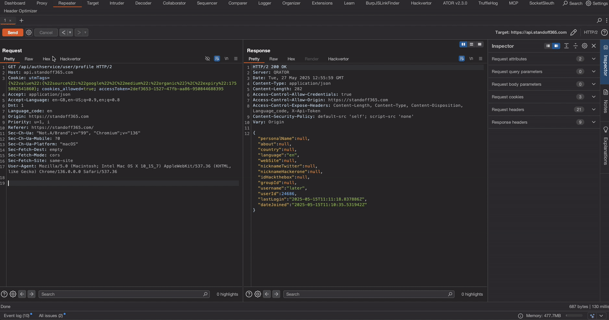

# Header & Cookie Optimizer Burp Suite Extension

## Overview

The "Header & Cookie Optimizer" is a Burp Suite extension designed to help penetration testers identify and remove unnecessary HTTP headers and cookies from requests. By sending modified requests and comparing responses to a baseline, it determines which headers and cookies are essential for a valid server response, potentially reducing the attack surface or identifying verbose client behavior.

This extension adds a custom tab to Burp Suite for configuration and logging, and a context menu item in the Repeater tool to initiate the optimization process on a selected request.

## Features

*   **Header Optimization**: Iteratively removes headers (except those specified to be skipped) and checks if the response changes significantly.
*   **Cookie Optimization**: After header optimization, iteratively removes individual cookies from the `Cookie` header and checks if the response changes significantly.
*   **Configurable Skip List**: Allows users to specify headers that should not be tested or removed (e.g., `Host`, `Content-Length`).
*   **Adjustable Response Difference Threshold**: Users can define the maximum percentage difference in response length that is considered "not significantly different."
*   **Configurable Request Delay**: Allows setting a delay between test requests to avoid overwhelming the server or triggering rate limits.
*   **Baseline Consistency Check**: Optionally sends the baseline request twice to check for inconsistent responses from the server, which might affect optimization reliability.
*   **Dedicated UI Tab**:
    *   Configuration settings for headers to skip, response difference threshold, and request delay.
    *   A log area to display the optimization process and results.
    *   A "Clear Logs" button.
*   **Context Menu Integration**: Adds an "Optimize Headers & Cookies" option to the right-click menu in the Repeater's request editor.
*   **Background Processing**: Runs the optimization process in a separate thread to prevent UI freezes.

## Configuration Options

The extension provides a "Header Optimizer" tab in Burp Suite with the following configuration options:

*   **Headers to skip (comma-separated)**: A comma-separated list of header names that will not be removed or tested.
    *   Default: `Host,Cookie,Content-Length,Content-Type`
*   **Max response difference (%)**: The maximum percentage difference in response length between the baseline and a test request for a header/cookie to be considered unnecessary. If the difference is greater than this value, the header/cookie is kept.
    *   Default: `5`
*   **Delay between requests (ms)**: The delay in milliseconds between sending test requests.
    *   Default: `500`
*   **Test baseline twice for consistency**: If checked, the extension will send the original request twice and compare the responses. A warning is logged if responses are inconsistent.
    *   Default: `True` (checked)

## How to Use

1.  Configure Jython in Burp Suite to run Python extensions.
2.  Install the `header-cookie-optimizer.py` extension file (see Installation section below).
3.  Navigate to the **Repeater** tool in Burp Suite.
4.  Select a request you want to optimize.
5.  Right-click in the request editor pane.
6.  Choose "**Optimize Headers & Cookies**" from the context menu.
7.  The optimization process will start, and logs will appear in the "**Header Optimizer**" tab.
8.  Once complete, the request in the Repeater tab will be updated with the optimized headers and cookies.

## Installation

To install this Python extension in Burp Suite:

1.  **Configure Jython**:
    *   If you haven't already, you need to configure Burp Suite to use Jython, which allows it to run Python-based extensions.
    *   Download the Jython standalone JAR file from the [Jython website](https://www.jython.org/download.html).
    *   In Burp Suite, go to **Extensions > Settings**.
    *   Under **Python Environment**, click **Select file** next to "Location of Jython standalone JAR file" and select the downloaded Jython JAR file.
2.  **Install the Custom Extension**:
    *   Go to **Extensions > Installed** and click the **Add** button.
    *   In the "Add extension" dialog:
        *   For **Extension Details**, set the **Extension type** to **Python**.
        *   Click **Select file** and choose the `header-cookie-optimizer.py` file.
        *   Optionally, configure where to save standard output and error messages for the extension.
    *   Click **Next**. Burp Suite will attempt to load the extension.
    *   Review any messages displayed in the **Output** and **Errors** tabs of the extension tool.
    *   Click **Close**.

The "Header & Cookie Optimizer" extension should now be installed, enabled, and visible in the **Extensions > Installed** list. A new tab named "Header Optimizer" should also appear in the Burp Suite UI.

For more general information on installing extensions, refer to the [PortSwigger documentation on manually installing extensions](https://portswigger.net/burp/documentation/desktop/extend-burp/extensions/installing/manual-install).

## Troubleshooting

*   Ensure Jython is correctly configured.
*   Check the extension's **Output** and **Errors** tabs (within Burp's **Extensions** tool, select the extension, then the respective sub-tabs) for any error messages.
*   The extension logs its actions to its dedicated "Header Optimizer" tab UI.
*   If requests are failing, check the Burp Suite **Alerts** tab for general network or HTTP issues.
*   The `send_request` method in the script attempts to determine the host, port, and protocol (HTTP/HTTPS) from the request headers. Ensure the request being optimized has a valid `Host` header and a correct request line to derive this information.
